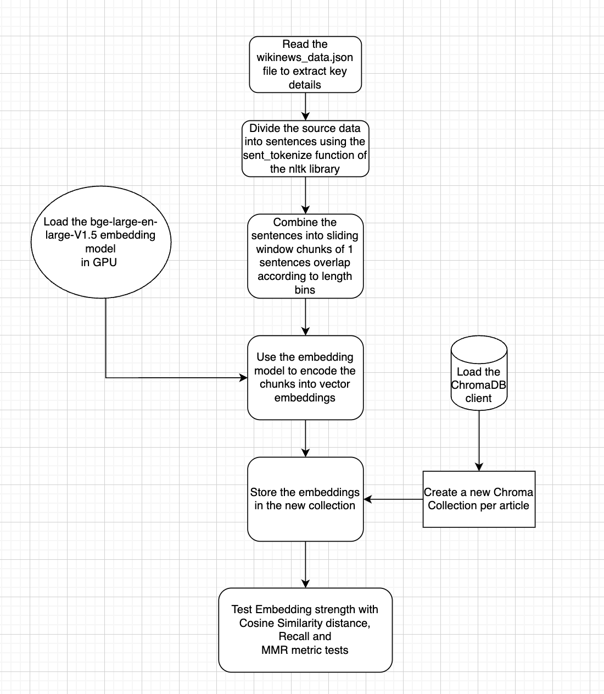
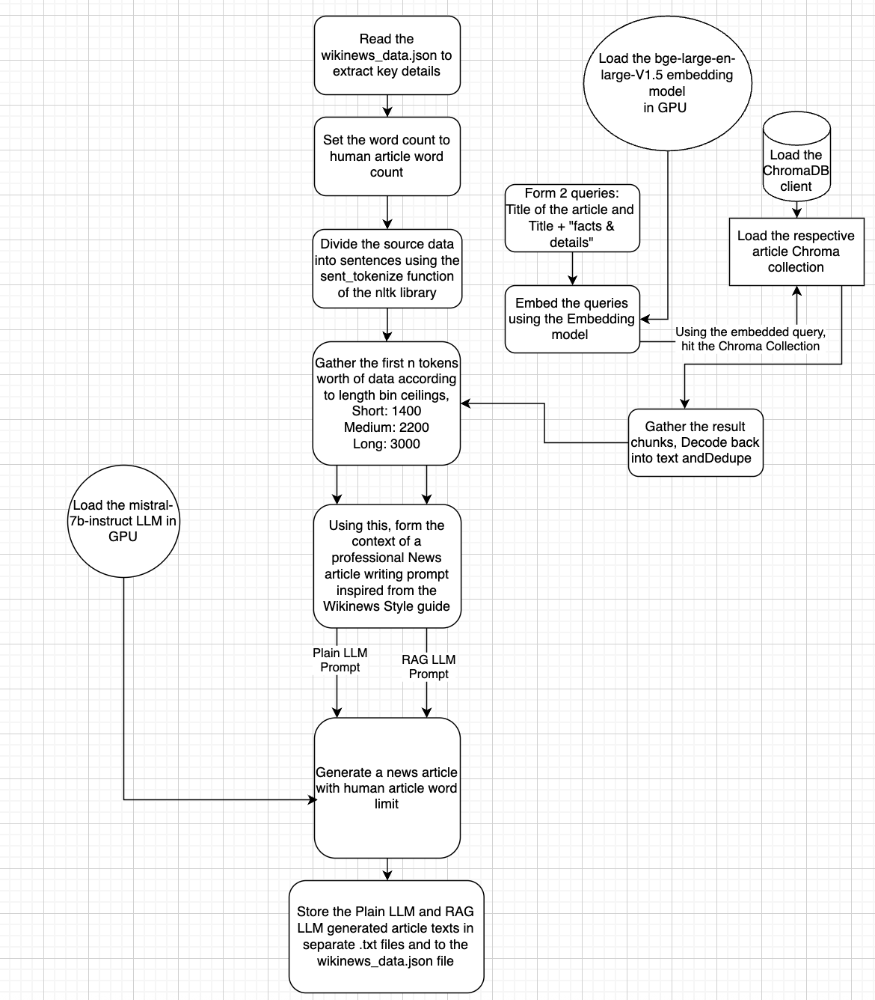
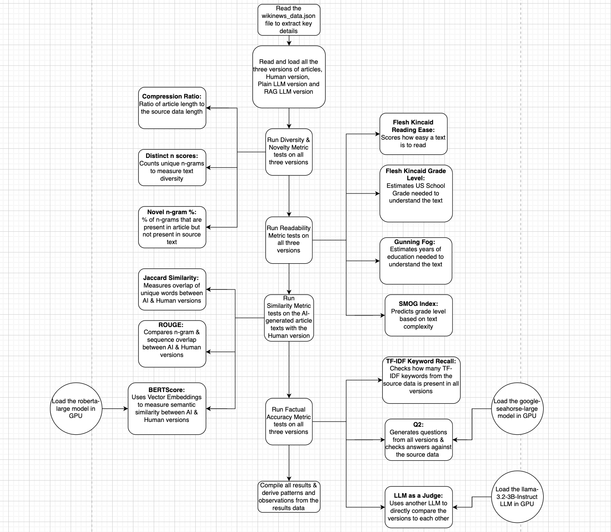

# NewsGenEval
MSc Data Science Dissertation project comparing Human vs AI writing using plain and RAG-enhanced LLMs, with a text evaluation pipeline having diversity, readability, similarity, and factual accuracy metrics.

## Overview
NewsGenEval is an MSc Data Science dissertation project that systematically compares human written news 
articles with AI generated articles, produced using:
 - a Plain Large Language Model (Only LLM with no retrieval), and
 - a Retrieval Augmented Generation (RAG) enhanced LLM.

The central research question addressed in this project is:

*How does AI generated text compare with human written text across key metrics such as diversity, readability, similarity, and factual accuracy?*

To answer this question, the project curates a benchmark dataset of 15 carefully selected Wikinews articles, chosen for being non-controversial, factual, and descriptive. The dataset is stratified across three length bins (short, medium, long) and five content categories (Entertainment, Sports, Politics & Policy, Science & Environment, and Business & Technology).
All three versions of each article (Human, Plain LLM, and RAG LLM) are evaluated using a fully automated text evaluation pipeline that combines classical NLP metrics with modern embedding-based and LLM-based evaluation techniques. Each AI-generated article is evaluated against its human-written counterpart using a comprehensive set of metrics covering:
 - Diversity & Novelty (Compression Ratio, Distinct-n Scores, Novel-n gram %)
 - Readability (Flesch Kincaid-Reading Ease, FK-Grade Level, Gunning Fog, SMOG Index)
 - Similarity (Jaccard Similarity, ROUGE, BERT)
 - Factual Accuracy (TF-IDF Keyword Recall, Q2, LLM-as-a-Judge)

**Image 1** - Overall workflow of *NewsGenEval*

The overall aim of this project is to quantitatively and qualitatively assess how close AI-generated news writing comes to human writing, and 
whether RAG improves the factual grounding and coverage compared to a plain LLM.

This project is useful because it,
- Provides a reproducible evaluation framework for AI-generated news.
- Demonstrates the impact of retrieval augmentation on factual accuracy.
- Combines classical NLP metrics with LLM-based evaluation.
- Demonstrates end-to-end AI/ML system design, and a fully automated production style NLP evaluation system.

## Tech Stack used

- **Python 3** – Main programming language 
- **pandas** – Data manipulation and tabular analysis 
- **NumPy** – Numerical operations and array-based computations
- **JSON** - JavaScript Object Notation format used for structured, human-readable data
- **requests** – HTTP requests for fetching data 
- **BeautifulSoup (bs4)** – HTML parsing and structured content extraction
- **newspaper3k** – Automated extraction of article text from news websites
- **trafilatura** – Robust boilerplate-free text extraction from web pages
- **Selenium** – Web Automation
- **NLTK** – Sentence tokenization and basic NLP preprocessing
- **scikit-learn** – ML library in Python
- **sentence-transformers** – Generation of dense semantic embeddings
- **ChromaDB** – Vector database for embedding storage and retrieval
- **PyTorch** – Model loading and GPU-accelerated inference
- **Hugging Face Transformers** – Access to pretrained LLMs and NLP models
- **textstat** - Computation of standard readability metrics for text analysis
- **ROUGE** – N-gram and sequence-level similarity evaluation between texts
- **BERTScore** – Semantic similarity evaluation using contextual embeddings
- **regex** – Text cleaning and token level processing 

## Models used
All models used in this project were installed from Hugging Face, a central repository 
used to download and manage all pretrained models.
- **BAAI/bge-large-en-v1.5** – Dense sentence embedding model used for semantic vector representation and retrieval
- **mistralai/Mistral-7B-Instruct** – Instruction tuned LLM used for plain and RAG-based news article generation
- **FacebookAI/roberta-large** – Pretrained transformer model used to compute BERT scores
- **google/seahorse-large-q2** – Question–answering model used for Q2-based factual consistency checks
- **meta-llama/Llama-3.2-3B-Instruct** – Instruction-tuned LLM used as an independent judge for qualitative article comparison

## Project Structure

# 1. Data Gathering (`helpers/wikinews_extractor.py`)

**Image 2** - Data Gathering Phase Workflow

This module implements the data collection and basic preprocessing stage of the project. 
Its purpose is to automatically extract human written Wikinews articles along with their externally 
cited source content, which later serves as the main reference/grounding material for 
RAG and factual evaluation.
The script first scrapes the main article text and source links directly from Wikinews using `requests` 
and `BeautifulSoup`, ensuring only the core article paragraphs are captured. 
For each cited external source, the script extracts the content using tools such as `newspaper3k` 
and `trafilatura`, which are well suited for static news pages, with `Selenium` employed as a 
fallback mechanism to handle dynamically rendered or JavaScript heavy webpages.
Later, basic text cleaning, word counting, and length based binning based on the word count 
(short, medium, long) are applied to standardise the data. All extracted source texts are concatenated into a 
single *source_data* field per article, which is later used for embedding, retrieval, and factual grounding. 
The final output is a structured, JSON record for each article, 
containing the human article, its sources, metadata, and derived statistics, 
forming the foundation for all subsequent generation and evaluation stages of the project.
(`data/wikinews_data.json`)

# 2. Chunking & Embedding (`pipeline/chunking_embedding.ipynb`)

**Image 3** - Chunking & Embedding Phase Workflow

The chunking and embedding phase operates article by article, ensuring that each Wikinews item is 
processed independently and stored in its own vector index. 
The aggregated *source_data* text for the article is first split into individual sentences using the 
`sent_tokenize` function from the `NLTK` library. These sentences are then combined into 
sliding window chunks, with a fixed sentence overlap, where the chunk size and 
total context length are adjusted based on the article’s word-count bin (short, medium, or long). 
This approach preserves local context while maintaining consistent chunk granularity 
across articles of different lengths. Each chunk is then encoded into a dense vector representation 
using the `bge-large-en-v1.5 sentence embedding model`, which is loaded on the GPU for 
efficient batch processing using `Pytorch`. The generated embeddings are stored in `ChromaDB`, with a 
new collection created for each article.
In addition to storage, this module also runs an embedding test data suite for each article. This suite 
consists of multiple preset query groups defined in the JSON file 
(embedding_test_data_suite key in the wikinews_data.json), where each group contains 
natural-language queries representing factual questions about the article, and the 
corresponding expected keywords derived from the human-written text.
These queries are embedded using the same embedding model and executed against the respective 
article’s ChromaDB collection. Retrieval quality is then assessed using `cosine similarity`, `recall`, 
and `Maximal Marginal Relevance (MMR)` metrics, providing an explicit validation step to 
confirm that the embeddings effectively capture the article’s factual content 
before it is used in the generation stage.

# 3. Content Generation (`pipeline/content_generation.ipynb`)

**Image 4** - Content Generation Phase Workflow

In the content generation phase, the pipeline again operates article by article, using the 
structured data stored in `wikinews_data.json`. For each article, the script first reads the 
human-written article metadata and explicitly sets the generation word limit to match the 
human article’s word count, ensuring fair length controlled comparison. 
An initial context window is formed based on predefined token ceilings that vary by length bin 
(short, medium, long).
For RAG based generation, two natural language queries are constructed per article, 
one using the article title, and another using the title combined with “facts and details”. 
These queries are embedded using the same `bge-large-en-v1.5` embedding model used before and 
executed against the article’s dedicated `ChromaDB` collection. The retrieved chunks are decoded back 
into text, deduplicated, and combined to form a grounded context for generation. 
For plain LLM generation, a fixed amount of source text is used directly without retrieval.
Both the plain and RAG contexts are then incorporated into a very clear, news writing prompt inspired 
by the `Wikinews style guide`, and passed to the `mistral-7b-instruct model`. 
The model generates a full news article under the predefined word limit. Finally, the generated 
Plain LLM and RAG LLM articles are stored both as separate text files and back into wikinews_data.json. 

# 4. Content Evaluation (`pipeline/content_evaluation.ipynb` & `helpers/average_data.py`)

**Image 5** - Content Evaluation Phase Workflow

In the content evaluation phase, the pipeline again processes the data article by article. 
For each article, a series of automated NLP based evaluation modules are applied to enable 
fair and consistent comparison across writing styles.
The evaluation begins with diversity and novelty metrics, including `compression ratio`, 
`distinct n-scores`, and `novel n-gram percentage`, which measure how much new lexical content 
each version introduces relative to the source data. This is followed by readability analysis, 
using established metrics such as `Flesch Reading Ease`, `Flesch–Kincaid Grade Level`, 
`Gunning Fog Index`, and `SMOG Index` to estimate how easily the text can be read and understood.
Next, similarity metrics are computed by directly comparing the different article versions
against the human written reference to see which version actually is the most similar. 
These include `Jaccard similarity` for lexical overlap, `ROUGE` scores for n-gram and sequence-level 
similarity, and `BERTScore`, which uses the pretrained `RoBERTa-large` model and 
contextual embeddings to capture semantic similarity between texts. 
For factual accuracy evaluation, the pipeline applies multiple complementary methods. 
`TF-IDF–based keyword recall` checks how many important source-derived terms appear in 
each article version. A `Q2-based factual consistency check` generates questions 
from the articles and validates answers against the source data using 
the pretrained `google/seahorse-large` question–answering model. 
Finally, an `LLM-as-a-Judge` approach uses a separate instruction-tuned LLM from a 
different model family than the one used for content generation, 
specifically the `Llama-3.2-3B-Instruct model`, to directly compare article pairs 
and produce winner labels, confidence scores, and natural-language reasoning across 
dimensions such as factual accuracy, coverage, coherence, neutrality, and readability.
All computed metrics and judgments are written back into wikinews_data.json, keeping the 
evaluation fully traceable at the article level. In addition, the `average_data.py` utility aggregates 
these per-article results across the entire dataset, computing average scores and summary statistics 
for each metric and article type. This final aggregation step enables high-level comparison and 
pattern analysis, supporting dataset-wide conclusions about the strengths and weaknesses of 
human writing, plain LLM generation, and RAG enhanced LLM generation.

## Results

Overall, with the current selection of Wikinews Corpus, different models used, approach, 
model settings etc. the results show that human written articles remain the strongest 
benchmark across all evaluation dimensions, particularly in diversity, novelty, and factual accuracy. 
Human articles consistently introduced more original language, richer structure, and 
fewer factual inaccuracies. Plain LLM-generated articles produced the most readable and fluent text, 
scoring highest on readability metrics, but this fluency often came at the cost of reduced novelty 
and occasional factual errors, especially in detail-sensitive domains such as sports and business. 
RAG-enhanced LLMs improved factual grounding by leveraging retrieved source material and were 
generally more reliable than the plain LLM, but this grounding reduced linguistic diversity and 
sometimes increased textual complexity, making the articles harder to read. Across article lengths
and categories, the same pattern held: humans excelled in originality and reliability, plain LLMs 
in accessibility, and RAG models in factual accuracy. Together, these findings highlight the 
trade-offs between fluency, originality, and factual accuracy in AI-generated news writing, 
with human journalism remaining the overall strongest performer.

## Steps to run the project
This project is best run in a GPU-enabled environment like Google Colab for instance.

1. Clone this repository
2. Install all the pre-requisite Libraries mentioned in the Tech Stack section
3. Add the required Wikinews articles to `helpers/wikinews_extractor.py` and run the script to generate wikinews_data.json. 
4. Populate the `embedding_test_data_suite` for each article in the JSON file. 
5. Download all pretrained models listed in the Models Used section from Hugging Face. 
6. the notebooks in the `pipeline/` directory (`chunking_and_embedding.ipynb`, `content_generation.ipynb`, `content_evaluation.ipynb`) 
article by article, updating the index accordingly. 
7. Run the `helpers/average_data.py` to aggregate results across all articles.

For complete technical and analytical details, please refer to the full dissertation report linked here.
https://drive.google.com/file/d/1_VUdKeQ7P8fgxAvdoC0UZ2KBioaWi0cf/view?usp=sharing
